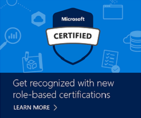

# Cloud vs. On-Premises Certification

Posted 04 Jan 2018 by **Selina Winter**

___

| | |
| --- | --- |
|  | *Guest blogger **David Elfassy** is a consultant and trainer specializing in Azure, Exchange, Windows, and Office 365. David splits his time between consulting and training on Microsoft solutions and overseeing teams of Microsoft Certified specialists that deploy, support, and manage on-premises and cloud-based infrastructures for the Netlogon Group.* |
| | |

By David Elfassy

## Careers Change. Certifications Change. Expectations Don’t.

When the Office 365 and Azure exams and the associated certifications were first released, I wondered if I should just certify on the “cloud stuff,” and let my on-prem certifications expire when new versions are released. As I noticed Microsoft’s engineering efforts lean heavily towards cloud-based solutions, I wondered if Windows Server, Exchange Server, SharePoint server, and their back-office cousins would still be around in a few years. I wondered what my choice would be. How much studying would be required for me to acquire the new skills necessary to get certified on the cloud? Should I just continue to work on those on-prem products that had served me so well for so many years?

Those questions are now several years behind me, and I can clearly see that a choice was never necessary. I realize how my vision became blurry, probably because of all the cloud talk going around me. As I recently recertified on the latest version of Windows Server (2016) and attained the latest Azure infrastructure certification ([MCSE: Cloud Platform and Infrastructure](https://www.microsoft.com/learning/mcse-cloud-platform-infrastructure.aspx)), along with certifications for products that have evolved in the cloud (PowerBI), I see how the evolution of my career has progressed in the same hybrid way that the certification program has evolved.

For me, three factors were relevant in choosing the right certifications.

- *What products do I work with?* Most of my clients have hybrid deployments that contain datacenters and Azure tenants. Their datacenters have Windows servers deployed, as well as their Azure tenants.  
**Relevant Certifications: [MCSA: Windows Server 2016](https://www.microsoft.com/learning/mcsa-windows-server-2016-certification.aspx), [MCSA: Cloud Platform](https://www.microsoft.com/learning/mcsa-cloud-platform-certification.aspx)**
- *What products do I want to specialize in for the next few years?* I see a lot of demand around data visualization, machine learning, and everything that relates to big data. I’ve been working towards building my knowledge and experience in those fields.  
**Relevant Certifications: [MCSA: BI Reporting](https://www.microsoft.com/learning/mcsa-bi-reporting.aspx), [MCSA: Machine Learning](https://www.microsoft.com/learning/mcsa-machine-learning.aspx)**
- *What products have the most widespread popularity and represent the biggest needs?* I’ve always hedged my bets with the “dial-tone” solutions that are present in all enterprises and represent the biggest need for day-to-day operations. Exchange Server (for email), Office 365 (for document sharing, email, IM, Voice), and Windows clients are deployed in every organization I’ve ever serviced.  
**Relevant Certifications: [MCSE: Cloud Platform and Infrastructure](https://www.microsoft.com/learning/mcse-cloud-platform-infrastructure.aspx), [MCSA: Office 365](https://www.microsoft.com/learning/mcsa-office365-certification.aspx), [MCSA: Mobility](https://www.microsoft.com/learning/mcse-mobility-certification.aspx)**  

I’m glad that most of the skills I’ve earned in the last 20 years have helped me gain stronger knowledge in the cloud, but I’m also glad that many of the products I’ve used in the last 20 years are now deployed in the cloud! My on-prem certifications are still part of my arsenal today!

