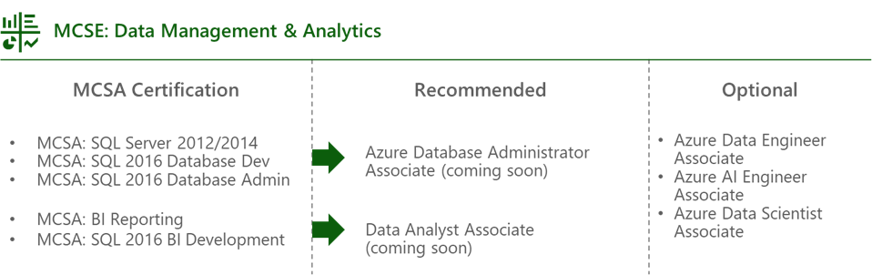

# Get a sneak peek at upcoming Microsoft Certifications for Data & AI

Posted 28 Feb 2020 by **Dandy Weyn, Data & AI Content Team Lead at Microsoft Worldwide Learning**

___

These days, everything starts with data. All kinds of data are being generated—machine, people, IoT, and social; relational and non-relational; and much more. And this data gets stored in operational databases that power applications, data warehouses that power BI reporting, and dashboards and data lakes for long-term storage and ad-hoc analytics.

So it’s no surprise that data professionals are key to digital transformation, modernizing relational SQL Server databases on-premises, migrating and administering them on Azure, or using the best of both worlds in hybrid environments. They’re also driving insights at cloud scale and managing the data—from ingesting and storing all the way to reporting.

Given the undeniable importance of data professionals and the clear need for them in today’s high-tech world (in organizations and businesses, large and small), we’re expanding our Data & AI certification portfolio to include two new role-based certifications, effective early April 2020: [Microsoft Certified: Azure Database Administrator Associate](https://aka.ms/azuredatabaseadministrator) and [Microsoft Certified: Data Analyst Associate](https://aka.ms/data.analyst).

**Azure Database Administrator Associate certification**  
The Azure Database Administrator implements and manages the operational aspects of cloud-native and hybrid data platform solutions built on Azure Data Services and SQL Server. This professional uses a variety of methods and tools to perform day-to-day operations, including applying knowledge of T-SQL for administrative management purposes.

This certification will only require one exam: [DP-300: Administering Relational Databases on Microsoft Azure](https://aka.ms/dp-300exam), which will measure key skills and knowledge. This includes the ability to plan and implement data platform resources, implement a secure environment, monitor and optimize operational resources, optimize query performance, automate tasks, plan and implement a high availability and disaster recovery environment, and use T-SQL for administration.

**Data Analyst Associate certification**  
The Data Analyst enables businesses to maximize the value of their data assets by using Microsoft Power BI. As subject matter experts, these professionals are responsible for designing and building scalable data models, cleaning and transforming data, and enabling advanced analytic capabilities that provide meaningful business value through easy-to-comprehend data visualizations.

This certification will also only require one exam: [DA-100: Analyzing Data with Microsoft Power BI](https://aka.ms/da-100exam), which will focus on measuring the ability to prepare, model, and visualize data, in addition to the ability to deploy and maintain deliverables.

## Can you picture yourself in these job roles?

Keep these additional decision points in mind, as you consider this career path. Candidates for the Azure Database Administrator Associate certification are database administrators and data management specialists who manage on-premises and cloud relational databases built on top of SQL Server and Azure Data Services. And candidates for the Data Analyst Associate certification use Power BI to enable businesses to maximize the value of their data assets.

If you’re working toward the Microsoft Certified Solutions Expert (MCSE): Data Management & Analytics path, please note that [MCSE certification opportunities retire on June 30, 2020](https://www.microsoft.com/en-us/learning/community-blog-post.aspx?BlogId=8&Id=375282), so you’ll want to pass your exams by that date. But be sure to consider these new certifications, which will replace the MCSE certification and can help you prove that your knowledge and skills in this specific job role are up to date. We keep our role-based training and certifications current to help you advance in an increasingly competitive cloud-based world. In fact, we’re constantly updating them to include new Microsoft features and services, helping to minimize any potential skill gaps. Consider the following graphic to help you decide which role-based certification fits you the best.

## Ready to get started on your certification journey?

Go for it! With stores of data—and the uses for it—growing exponentially, the need for skilled Azure Database Administrators and Data Analysts will only continue to increase. These new Microsoft Certifications offer the opportunity to show companies that you have what they need when they’re hiring for these exciting job roles.

Stay tuned for the official announcement of these new certifications on the [Microsoft Learning Blog](https://www.microsoft.com/en-us/learning/community-blog.aspx) or on Twitter at [@MicrosoftLearn](https://twitter.com/MicrosoftLearn). And be sure to follow me on Twitter at [@ilikesql](https://twitter.com/ilikesql).