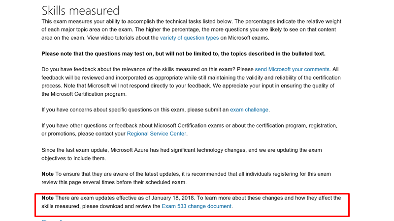

# How to Think About Exam Preparation in This New World

Posted 29 Mar 2018 by **Liberty Munson (Microsoft)**

___

As Microsoft embraces the power and flexibility of the cloud to deliver our software and solutions, we are experiencing ripple effects on our learning and exam content. Features and functionality in our software is changing on a monthly, weekly, and, in some cases, daily basis. This challenge is not unique to Microsoft. All IT learning and certification programs are facing it. **How do we keep our exam content up to date with the rapid pace of change?**

The pace of change not only affects our ability to keep exams and learning content up to date—it also affects how you prepare for exams. ("Should prepare" may be more accurate—if you haven't changed how you're preparing for exams, you may want to give some thought as to why, and then share it here . . . maybe you have a strategy that can benefit all of us! Thank you!)

Through trial and error and constant iterations of our development process, we have found a way to keep the content on our exams (mostly) current. In fact, for our cloud-based exams, you can expect exam updates every two months. On more stable technologies, updates will be less frequent. As exams get updated, we also try to update the Microsoft Official Courses (MOCs) and MOC On-Demand materials to keep pace, although they occasionally lag behind exam updates.

The challenge, of course, from a test taker's perspective is what to do when that change happens in the middle of your preparation. There is no easy answer, unfortunately, and we know it can be very frustrating.

One idea that I've heard many times is to have different versions of the exam in market—allow people to choose between taking the "old" version or the "updated" version. While I completely understand the challenge that frequently updating exams presents to candidates, we can't have the same exam in market covering different versions of our technologies. Our stakeholders (i.e., the person who will make hiring or promotion decisions about YOUR skills based on your exam history and/or attained certification) need to have a clear picture of the skills tested by an exam or through the certification process. You can imagine how confusing and complicated multiple exams covering different versions would be from their perspective. Further, multiple exams would undermine the validity of the exam and the corresponding certification.

As a result, we give candidates as much notice as possible when we are going to update exams. The **Exam Details page **is the best source of information because we post a notice on that page with the date that the change will go into effect. We also provide a downloadable PDF that explains the changes, as shown below (from [Exam 70-533](https://www.microsoft.com/learning/exam-70-533.aspx)):

I'm working with the team to change the flow of the page to better highlight this very important information. This change will take some time to come to fruition, so please be aware of where to find the info—in the last paragraph under the Skills Measured heading (immediately before the list of skills). (The [Browse all exams](https://www.microsoft.com/learning/exam-list.aspx) page lists all active exam detail pages.)

We've explored other options, including emailing candidates who are registered to take an exam after it will be updated; however, GDPR (Europe's new privacy laws) as well as Microsoft's own privacy requirements and contact rules make this extremely difficult to do, even bordering on impossible. For example, if you've opted out of Microsoft communications at any time for any reason, we can't contact you.

We've toyed with the idea of people signing up for automatic notifications that are sent when an exam details page of interest is updated, but that requires website redesign at a minimum, and we'd still have to comply with all the privacy rules I just mentioned.

We are also discussing if we should change our process to update the learning content BEFORE we update the exam. Because exams aren't dependent on the learning content (in other words, you don't need to take a course to prepare for an exam), this shouldn't matter, but enough people take a course as exam preparation that we're considering if and how we would do this.

**So, how do you change the way you prepare for exams in this new world?**

- Regularly check the Exam Details page for updates. This is something to do as often as it makes sense given the pace that changes are occurring in the technology covered in the exam.
- Check the Exam Details page a month or less before you plan to take the exam. Our goal is to provide at least a 30-day notice of changes, so this should be sufficient as you do the last of your preparation. (I will caveat this to add that there has been one occasion—and only one in my 11 years at Microsoft—where we had to give less notice because the circumstances required it. Remember that we make these changes to ensure the validity of your certification!)
- If you're preparing for a cloud-based exam, keep in mind that we are updating those exams every two months, and plan your preparation and when to take the exam accordingly.
- If you find a preparation resource listed on the Exam Details page that is no longer relevant, please let us know ([mslcd@microsoft.com](mailto:mslcd@microsoft.com))! We may overlook something as we update the Exam Details page to reflect exam changes.

If you have ideas on other approaches that we might take to address this thorny issue, post them here. I would love to hear your ideas!

