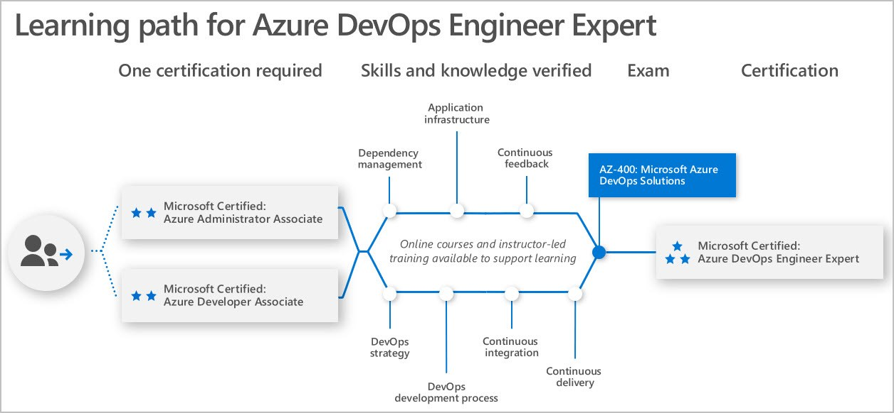

# Introducing the Microsoft DevOps Engineer Expert Certification: What You Need to Know

Posted 26 Feb 2019 by **Liberty Munson (Microsoft)**

___

As some of you may know, on November 4, 2018, Microsoft released Exam [AZ-400: Microsoft Azure DevOps Solutions](https://www.microsoft.com/learning/exam-AZ-400.aspx) in beta. Over the course of the beta period, we received a surprisingly large number of comments and feedback from many key (and passionate) internal and external stakeholders, so we temporarily paused the beta exam while we investigated several core concerns. As many of you know, we have tried to publish a DevOps exam/certification multiple times over the past few years, but we have not been able to do so. (The most recent case in point being our announcement of a certification based on Exams 70-537 and 70-538 at Ignite in 2018 that was intended to cover this content area. I still get questions about what happened to those exams—our move to role-based certifications and AZ-400 are what happened to those exams. AZ-400 covers the content that would have been on 537 and 538.) That’s why we paused the AZ-400 beta and took the time to make sure we addressed the issues that were raised. We want to make sure this exam and certification reflect the Azure DevOps Engineer job role. As you prepare for the exam, here are a few things you should know:

1. The exam is broad because DevOps is a very broad area—both Dev and Ops are already big so when you combine the two     it is going to be broad. The exam is designed to assess what key employers need a DevOps engineer to know in order     to trust that s/he is sufficiently skilled to be able to competently advise their digital transformation with          DevOps.

    Because of the broad space, the exam itself only goes deep in a few areas:

    - Azure DevOps (formerly VSTS and TFS)
    - Version Control (focusing on Git but touching on TFVC)
    - ARM (a fundamental automation concept when dealing with Azure automation)
    - PowerShell (another fundamental concept that we want Azure people to be aware of even if they come from a Unix/Bash background)

    As a result, for many of the areas in the objective domain, you need a basic level of knowledge. You need to understand the skills and where they fit into the overall landscape, but you are not being specifically tested on them in detail. You don’t need expert knowledge of Bash scripts or how to code in C#, C++, or Java, etc., but you do need to know under what conditions you might need to use those scripts, code, or knowledge.

    All the subject matter experts (SMEs) who reviewed the exam said that it did good job balancing between Dev and Ops. It balanced the fact that Microsoft’s customers have heterogeneous environments while covering enough depth in the Microsoft-specific technologies to be able to qualify someone as Microsoft certified for DevOps on Azure.

    **As a DevOps engineer, you need to know something about a lot of different areas. We have ensured that the breadth of the exam is accurately reflected in the objective domain and that the items cover these domains at a higher level than we might otherwise assess.**

2. To be a successful DevOps engineer, you must know how and when to use third-party tools. Again, SMEs said that qualified candidates, and ultimately DevOps experts, would have an awareness of third-party tools as well as the use cases and limitations of those tools, but that a deep understanding of third-party tools and implementation details was out of scope. In other words, every internal and external SME that we asked said that use of third-party technologies was fair and reasonable.

    **As a DevOps engineer, you are expected to know something about third-party tools. We have ensured that these items are at the appropriate level and that the expectation that you will have a high-level understanding of third-party tools is reflected in the objective domain.**

Now that you better understand Microsoft’s approach to DevOps, how about becoming a [Microsoft Certified: DevOps Engineer Expert](https://www.microsoft.com/learning/azure-devops.aspx)? Here’s what you need to do:

1. Earn your [Microsoft Certified: Azure Administrator Associate](https://www.microsoft.com/learning/azure-administrator.aspx) OR your [Microsoft Certified: Azure Developer Associate](https://www.microsoft.com/learning/azure-developer.aspx) certification.

2. Pass Exam [AZ-400: Microsoft Azure DevOps Solutions](https://www.microsoft.com/learning/exam-AZ-400.aspx).

Earning this certification is tough, but once you do, all your effort will be worth it. You will be one of the best of the best. Best of luck on your certification journey!

**Instructor-led Training for Exam EZ-400**

| Course title / training titles | Course ID | Course duration |
| --- | --- | --- |
| Implement DevOps development processes |   [AZ-400T01](https://www.microsoft.com/learning/course.aspx?cid=AZ-400T01) | 1 Day |
| Implement continuous integration |   [AZ-400T02](https://www.microsoft.com/learning/course.aspx?cid=AZ-400T02) | 1 Day |
| Implement continuous delivery |   [AZ-400T03](https://www.microsoft.com/learning/course.aspx?cid=AZ-400T03) | 1 Day |
| Implement dependency management |   [AZ-400T04](https://www.microsoft.com/learning/course.aspx?cid=AZ-400T04) | 1 Day |
| Implement application infrastructure |   [AZ-400T05](https://www.microsoft.com/learning/course.aspx?cid=AZ-400T05) | 1 Day |
| Implement continuous feedback |   [AZ-400T06](https://www.microsoft.com/learning/course.aspx?cid=AZ-400T06) | 1 Day |
| Design a DevOps strategy |   [AZ-400T07](https://www.microsoft.com/learning/course.aspx?cid=AZ-400T07) | 1 Day |

**Related announcements**

[Skill up and stand out, with new role-based training and certification!](https://www.microsoft.com/en-us/learning/community-blog-post.aspx?BlogId=8&Id=375161)

[Catching up: continuing our journey with new role-based certifications and training](https://www.microsoft.com/en-us/learning/community-blog-post.aspx?BlogId=8&Id=375200)

[New role-based certification and training is here, and we’re just getting started!](https://www.microsoft.com/en-us/learning/community-blog-post.aspx?BlogId=8&Id=375159)

[Are You an Azure Solutions Architect? Take the New Role-Based Certification Exams Today!](https://www.microsoft.com/en-us/learning/community-blog-post.aspx?BlogId=8&Id=375157)

[Exam and Certification Retirement Roundup, December 2018](https://www.microsoft.com/en-us/learning/community-blog-post.aspx?BlogId=8&Id=375189)

[Microsoft’s New Fundamentals Certification Program Launches with Azure and Microsoft 365](https://www.microsoft.com/en-us/learning/community-blog-post.aspx?BlogId=8&Id=375158)

[AZ-900: Microsoft Azure Fundamentals Now Available—Register Today!](https://www.microsoft.com/en-us/learning/community-blog-post.aspx?BlogId=8&Id=375190)

[Great News, Azure Developers! Microsoft is Simplifying Your Path to Certification!](https://www.microsoft.com/en-us/learning/community-blog-post.aspx?BlogId=8&Id=375185)

[New Offer: Certify with Confidence](https://www.microsoft.com/en-us/learning/community-blog-post.aspx?BlogId=8&Id=375201)

[Wow! A Summary of All Exams and Certifications Launched in January, 2019!](https://www.microsoft.com/en-us/learning/community-blog-post.aspx?BlogId=8&Id=375204)

