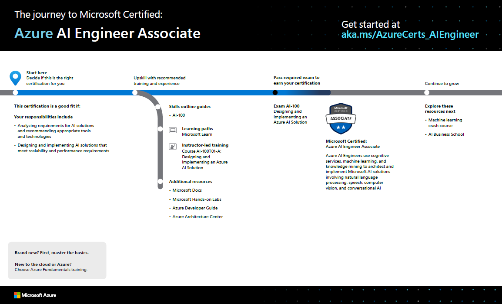

# Level up with Microsoft Certified: Azure AI Engineer Associate

Posted 20 May 2020 by **Sandra Marin, Azure training and certification GTM lead, Microsoft Learning**

___

Do you spend your time imagining what you could do with artificial intelligence (AI)—and then putting AI to use? There are endless ways to demonstrate your AI skills. You could build an app that translates speech in near real time or an app that helps identify parts of a motor in a mixed-reality training. If you have experience building with AI, it’s time to prove your skills.

The [Azure AI Engineer Associate](https://docs.microsoft.com/learn/certifications/azure-ai-engineer) certification gives you the opportunity to prove your subject matter expertise in cognitive services, machine learning, and knowledge mining to architect and implement Microsoft AI solutions involving natural language processing (NLP), speech, computer vision, and conversational AI. To earn this certification, you must first pass exam [AI-100: Designing and Implementing an Azure AI Solution](https://docs.microsoft.com/learn/certifications/exams/ai-100).

You’re on the right path to this certification if your responsibilities include analyzing requirements for AI solutions, recommending the appropriate tools and technologies, and designing and implementing AI solutions that meet scalability and performance requirements. You should have experience translating the vision from solution architects and working with data scientists, data engineers, IoT specialists, and software developers to build complete end-to-end solutions.

In addition, you should have knowledge and experience designing and implementing AI apps and agents that use Azure Cognitive Services and Cognitive Search, Azure Bot Service, and data storage in Azure. Plus, you should be able to recommend solutions that use open-source technologies, understand the components that make up the Azure AI portfolio and the available data storage options, and know when a custom API should be developed to meet specific requirements.

## How can you get ready?

To help you plan your journey, check out ["The journey to Microsoft Certified: Azure AI Engineer Associate" infographic](https://query.prod.cms.rt.microsoft.com/cms/api/am/binary/RE4ww2u). You can also find it in the [resources section](https://docs.microsoft.com/learn/certifications/azure-ai-engineer#certification-resources) on the certification and exam pages, which contains other valuable help for Azure AI Engineer Associates.

Follow the sequence in the infographic to map out your journey. First, decide whether this is the right certification for you.

Next, review the **skills outline guide** to understand what you will be measured on when taking exam AI-100.

Sign up for training that fits your learning style and experience. Choose **curated learning paths on Microsoft Learn** or **instructor-led training**. Measure your skills to see where you stack up and follow learning paths on **Pluralsight**. Complement your training with additional resources, like Microsoft Docs, Microsoft Hands-on Labs, Azure Developer guide, or Azure Architecture Center.

After you pass your exam and earn your certification, there are more opportunities for growth. Consider taking more courses in machine learning and AI.

**Note**: Remember that Microsoft certifications assess how well you apply what you know to solve real business challenges. Our training resources are useful for reinforcing your knowledge, but you’ll always need experience in the role and with the platform.  

## Time to level up!

By attaining a certification that validates your AI development and other skills with Azure, you validate to your employer and future employers that you have what it takes to build end-to-end solutions using AI. Open up new possibilities for turning your ideas into solutions!

## Related announcements

[Understanding Microsoft Azure certifications](https://www.microsoft.com/en-us/learning/community-blog-post.aspx?BlogId=8&Id=375305)  
[Finding the right Microsoft Azure certification for you](https://www.microsoft.com/en-us/learning/community-blog-post.aspx?BlogId=8&Id=375306)