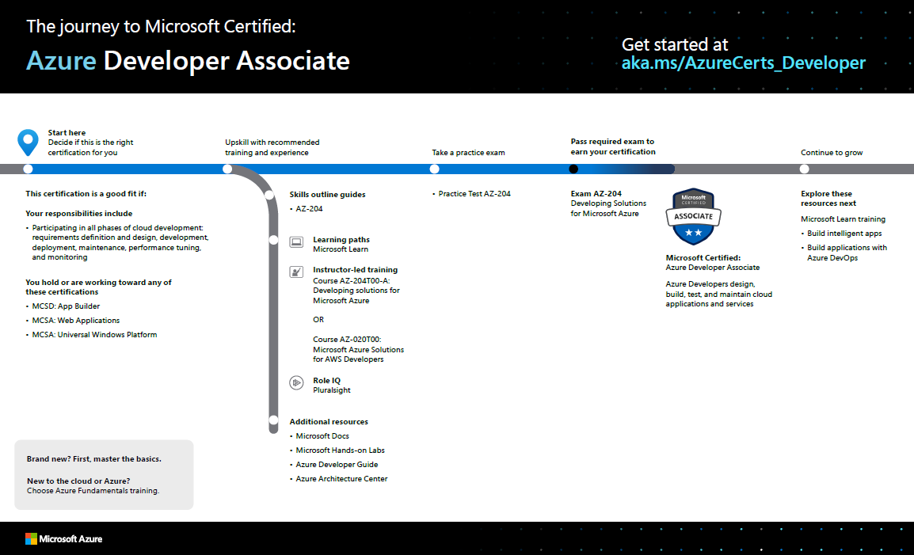

# Level up with Microsoft Certified: Azure Developer Associate

Posted 20 May 2020 by **Sandra Marin, Azure training and certification GTM lead, Microsoft Learning**

___

Whether you’re a professional developer or you write code for fun, developing with Microsoft Azure puts the latest cloud technology and best-in-class developer tools at your fingertips. You can even use your preferred language to build for the cloud. How do you prove to the world that you have these modern skills?

The [Azure Developer Associate](https://docs.microsoft.com/learn/certifications/azure-developer) certification validates that you have what it takes to design, build, test, and maintain cloud applications and services on Azure. You earn it by passing exam [AZ-204: Developing Solutions for Microsoft Azure](https://docs.microsoft.com/learn/certifications/exams/az-204).

If your responsibilities include all phases of cloud development—from requirements definition and design, to development, deployment, and maintenance, performance tuning, and monitoring—this is the certification for you.

## What are the prerequisites?

As a candidate for this certification, you should have one or two years of professional development experience, including experience with Azure. Other requirements include the ability to program in a language supported by Azure. Proficiency in Azure SDKs, Azure PowerShell, Azure CLI, data storage options, data connections, and APIs is also important, along with experience in app authentication and authorization, compute and container deployment, debugging, performance tuning, and monitoring.

## How can you get ready?

To help you plan your journey, check out our [“The journey to Microsoft Certified: Azure Developer Associate” infographic](https://query.prod.cms.rt.microsoft.com/cms/api/am/binary/RE4woK5). You can also find it in the [resources section](https://docs.microsoft.com/learn/certifications/azure-developer#certification-resources) on the certification and exam pages, which contains other valuable help for Azure developers.

To map out your journey, follow the sequence in the infographic. First, decide whether this is the right certification for you.

Next, to understand what you’ll be measured on when taking exam AZ-204, review the **skills outline guide** on the exam page.

Sign up for training that fits your learning style and experience. Choose **curated learning paths on Microsoft Learn** or **instructor-led training** for the Azure developer or for an AWS developer coming to Azure. Measure your skills to see where you stack up and follow learning paths on **Pluralsight**. Complement your training with additional resources, like Microsoft Docs, Microsoft Hands-on Labs, the Azure Developer Guide, or Azure Architecture Center.

Then, take a trial run with the **AZ-204 Microsoft Official Practice Test**. All objectives of the exam are covered in depth, so you’ll find what you need to be ready for any question.

After you pass the exam and earn your certification, check out the many other certification opportunities. Want to add to your toolkit? Consider skilling up on AI apps or in DevOps.

**Note**: Remember that Microsoft Certifications assess how well you apply what you know to solve real business challenges. Our training resources are useful for reinforcing your knowledge, but you’ll always need experience in the role and with the platform.  

## It’s time to level up!

As a developer, when you grow your Azure skills, you can take advantage of more than 200 services to build, deploy, and manage applications—in the cloud, on-premises, and at the edge—using the tools and frameworks of your choice. Earn your certification, and open up new possibilities for your career and for turning your ideas into solutions on Azure.

## Related announcements

[Understanding Microsoft Azure certifications](https://www.microsoft.com/en-us/learning/community-blog-post.aspx?BlogId=8&Id=375305)  
[Finding the right Microsoft Azure certification for you](https://www.microsoft.com/en-us/learning/community-blog-post.aspx?BlogId=8&Id=375306)