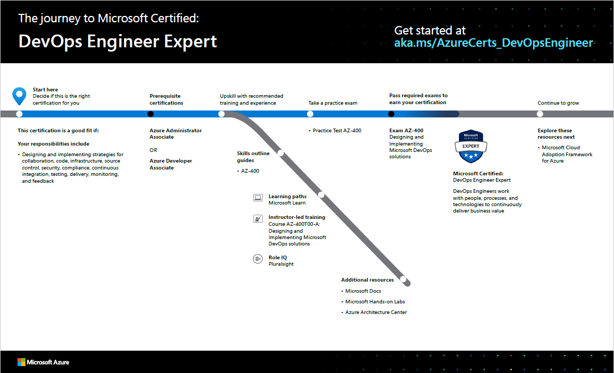

# Level up with Microsoft Certified: DevOps Engineer Expert

Posted 20 May 2020 by **Sandra Marin, Azure training and certification GTM lead, Microsoft Learning**

___

Modern IT emphasizes working with people, processes, and technologies to continuously deliver business value, and if you have these skills, [DevOps Engineer Expert](https://docs.microsoft.com/learn/certifications/devops-engineer) is the role-based certification for you.

Although the names recently changed for this certification and the associated exam, the job role and exam objective domains remain the same. To learn more about the name changes, check out [The Azure DevOps Expert certification will have a new name](https://www.microsoft.com/en-us/learning/community-blog-post.aspx?BlogId=8&Id=375302).

As a prerequisite for this expert-level certification, earn either the [Azure Administrator Associate](https://docs.microsoft.com/learn/certifications/azure-administrator) or the [Azure Developer Associate](https://docs.microsoft.com/learn/certifications/azure-developer) certification. Then, pass exam [AZ-400: Designing and Implementing Microsoft DevOps Solutions](https://docs.microsoft.com/learn/certifications/exams/az-400).

This certification a good fit for you if your responsibilities include designing and implementing strategies for collaboration, code, infrastructure, source control, security, compliance, continuous integration, testing, delivery, monitoring, and feedback. You should have experience working with people, processes, and technologies to continuously deliver business value. Additionally, you should be familiar with (or expert in) Azure administration and development. The certification is a great way for system administrators or developers to prove their expertise in DevOps.

## How can you get ready?

To help you plan your journey, check out our "[The journey to Microsoft Certified: DevOps Engineer Expert](https://query.prod.cms.rt.microsoft.com/cms/api/am/binary/RE4wyqC)" infographic. You can also find it in the [resources section](https://docs.microsoft.com/learn/certifications/devops-engineer#certification-resources) on the certification and exam pages, which contains other valuable help for DevOps Engineers.

Follow the sequence in the infographic to map out your journey. First, decide whether this is the right certification for you.

Be sure that you have a **prerequisite certification for this exam**—either Azure Administrator Associate or Azure Developer Associate.

Next, review the **skills outline guide** to understand what you’ll be measured on when you take exam AZ-400.

Sign up for training that fits your learning style and experience. You can choose curated **learning paths on Microsoft Learn** or **instructor-led training**. Measure your skills to see where you stack up and follow learning paths on **Pluralsight**. Complement your training with additional resources, like Microsoft Docs, Microsoft Hands-on Labs, the Azure Developer Guide, or Azure Architecture Center.

Then, rehearse with the **AZ-400 Microsoft Official Practice Test**. To help you be prepared for any question, all objectives of the exam are covered in depth.

After you pass your exam and earn your certification, there are many additional opportunities for growth. Keep your skills up to date, and consider earning another expert-level certification.

**Note**: Remember that Microsoft certifications assess how well you apply what you know to solve real business challenges. Our training resources are useful for reinforcing your knowledge, but you’ll always need experience in the role and with the platform.  

## It’s time to level up!

You’re a leader at making DevOps an effective practice for your organization. Earn your certification to help advance your career, gain recognition as an expert, and validate your technical knowledge and abilities as you drive your career into the future.

## Related announcements

[Understanding Microsoft Azure certifications](https://www.microsoft.com/en-us/learning/community-blog-post.aspx?BlogId=8&Id=375305)  
[Finding the right Microsoft Azure certification for you](https://www.microsoft.com/en-us/learning/community-blog-post.aspx?BlogId=8&Id=375306)