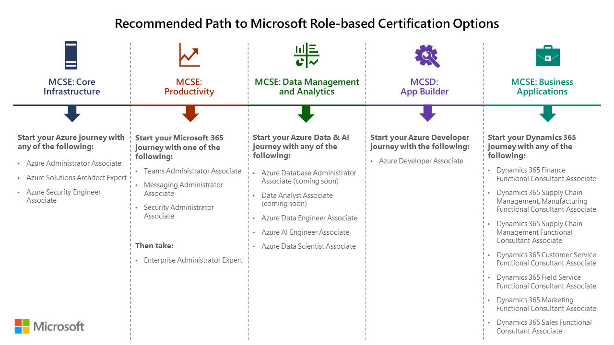

# MCSA, MCSD, MCSE certifications retire; with continued investment to role-based certifications

Posted 28 Feb 2020 by **Alex Payne, GM, Global Technical Learning at Microsoft Worldwide Learning**

___

UPDATE: March 26, 2020. All remaining exams associated with Microsoft Certified Solutions Associate (MCSA), Microsoft Certified Solutions Developer (MCSD), Microsoft Certified Solutions Expert (MCSE) will retire on January 31, 2021

Microsoft’s focus on role-based training and certifications can help you develop necessary skills and experience to advance in an accelerated and increasingly competitive cloud-based world. Role-based training and certifications are kept current with new features and services that Microsoft is constantly adding to the cloud solution areas, minimizing skill gaps associated with the applicable job roles.

Since we announced our [focus on role-based training and certifications in September 2018](https://www.microsoft.com/en-us/learning/community-blog-post.aspx?BlogId=8&Id=375159), we’ve added a total of 34 certifications to our portfolio across Azure, Modern Workplace, and Business Applications. As we continue to expand on role-based learning offerings, all remaining exams associated with Microsoft Certified Solutions Associate (MCSA), Microsoft Certified Solutions Developer (MCSD), Microsoft Certified Solutions Expert (MCSE) will retire **on June 30, 2020**.

If you’re working towards a MCSA, MCSD, or MCSE certification, you’ll want to pass all required exams before they retire. The [list below](#exams-retiring-on-june-30-2020) shows existing exams that will retire. Note that training content may continue to be available in these areas even after the exams have retired.

If you have an existing MCSA, MCSD, and MCSE certification, it will remain on your Microsoft transcript, even after the exams retire. In fact, it will remain in the active section of your transcript for two years from June 30, 2020; at that time the certification will be moved to the “inactive” section of your transcript.

If you currently hold a MCSA, MCSD, or MCSE certification, why not update your profile with one of our new role-based certifications that may be relevant to you. Check out our recommended role-based certifications:

  
([Download recommended certification path](https://aka.ms/Certretirement))

Be sure to visit [Microsoft Learn](https://docs.microsoft.com/learn/certifications/) to discover all the information you need to know about the role-based  certification that best matches your career aspirations. On Microsoft Learn, you’ll find information on free self-paced online training and/or with classroom training available, through Microsoft Learning Partners, to help you prepare for certification. We look forward to having you join us on this exciting journey as we evolve our certifications to focus on job roles that better-align with industry and hiring trends, helping you keep pace with today’s business and technology needs.

For answers to common questions, please see our [FAQ below](#faq).

## Certifications with exams scheduled to retire on June 30, 2020

MCSA: BI Reporting  
MCSA: Dynamics 365 for Operations  
MCSA: SQL 2016 BI Development  
MCSA: SQL 2016 Database Admin  
MCSA: SQL 2016 Database Dev  
MCSA: SQL Server 2012/2014  
MCSA: Universal Windows Platform  
MCSA: Web Applications  
MCSA: Windows Server 2012  
MCSA: Windows Server 2016  
MCSD: App Builder  
MCSE: Business Applications  
MCSE: Core Infrastructure  
MCSE: Data Management & Analytics  
MCSE: Productivity  

## Exams Retiring on June 30, 2020

_These exams retire at 11:59 PM Central Time on June 30, 2020._

70-333: Deploying Enterprise Voice with Skype for Business 2015  
70-334: Core Solutions for Microsoft Skype for Business 2015  
70-339: Managing Microsoft SharePoint Server 2016  
70-345: Designing and Deploying Microsoft Exchange Server 2016  
70-457: Developing Mobile Apps  
70-410: Installing and Configuring Windows Server 2012  
70-411: Administering Windows Server 2012  
70-412: Configuring Advanced Windows Server 2012 Services  
70-413: Designing and Implementing a Server Infrastructure  
70-414: Implementing an Advanced Server Infrastructure  
70-417: Upgrading Your Skills to MCSA Windows Server 2012  
70-461: Querying Microsoft SQL Server 2012/2014  
70-462: Administering Microsoft SQL Server 2012/2014 Databases  
70-463: Implementing a Data Warehouse with Microsoft SQL Server 2012/2014  
70-464: Developing Microsoft SQL Server 2012/2014 Databases  
70-465: Designing Database Solutions for Microsoft SQL Server  
70-466: Implementing Data Models and Reports with Microsoft SQL Server  
70-467: Designing Business Intelligence Solutions with Microsoft SQL Server  
70-480: Programming in HTML5 with JavaScript and CSS3  
70-483: Programming in C#  
70-486: Developing ASP.NET MVC Web Applications  
70-487: Developing Microsoft Azure and Web Services  
70-537: Configuring and Operating a Hybrid Cloud with Microsoft Azure Stack  
70-705: Designing and Providing Microsoft Licensing Solutions to Large Organizations  
70-740: Installation, Storage, and Compute with Windows Server 2016  
70-741: Networking with Windows Server 2016  
70-742: Identity with Windows Server 2016  
70-743: Upgrading Your skills to MCSA: Windows Server 2016  
70-744: Securing Windows Server 2016  
70-745: Implementing a Software-Defined Datacenter  
70-761: Querying Data with Transact-SQL  
70-762: Developing SQL Databases  
70-764: Administering a SQL Database Infrastructure  
70-765: Provisioning SQL Databases  
70-767: Implementing a Data Warehouse using SQL  
70-768: Developing SQL Data Models  
70-777: Implementing Microsoft Azure Cosmos DB Solutions  
70-778: Analyzing and Visualizing Data with Microsoft Power BI  
70-779: Analyzing and Visualizing Data with Microsoft Excel  
MB2-716: Microsoft Dynamics 365 Customization and Configuration  
MB6-894: Development, Extensions and Deployment for Microsoft Dynamics 365 Finance  
MB6-897: Microsoft Dynamics 365 for Retail  
MB6-898: Microsoft Dynamics 365 Human Resources  

## FAQ

**Q. What happens to the MCSA, MCSD, MCSE certifications that I already have?**

**A:** Nothing happens to the MCSA, MCSD, and MCSE certification that you already have; they remain on your certification transcript even after the exams retire. In fact, it will remain in the active section of your transcript for two years from June 30, 2020; at that time the certification will be moved to the “inactive” section of your transcript.

**Q. Can I still achieve the MCSA, MCSD, MCSE certifications before they retire on June 30, 2020?**

**A:** Yes, you can continue earning the MCSA, MCSD, and MCSE certifications as long as the required exams are still available. As we retire the exams that are part of those certification paths, you will no longer be able to earn those certifications.

**Q. You’re retiring exams that lead to the MCSA, MCSD, and MCSE certification(s) that I am pursuing. What should I do?**

**A:** Before the exams expire, you must pass all required exams which are a part of the MCSA, MCSD, or MCSE certification(s) that you are trying to achieve. If you pass the required exams before they expire, you will earn the certification and it will appear on your certification transcript.

**Q. If Microsoft is focused on role-based certifications, what will happen to Windows Server and SQL Server certifications? Will there be Windows Server 2019 and SQL Server 2019 certifications available?**

**A:** No, there will not be Windows Server 2019 and SQL Server 2019 certifications. Windows Server 2019 and SQL Server 2019 content will be included in role-based certifications on an as-needed basis for certain job roles in the Azure Apps & Infrastructure and Data & AI solution areas.

**Q. How do the exam retirements affect Microsoft partner competencies if my company is a part of the partner network?**

**A:** If you passed a qualifying exam prior to its retirement, it will still count toward competency attainment for 12 months after the exam is retired. If you have not passed the required exams, please see this [overview document](https://assetsprod.microsoft.com/updated-competency-exams-and-certifications.pdf) for the full list of retiring and new exams and certifications required for competency attainment and renewal. The new exams and certifications will be available in Partner Center in March 2020.

**Q. Does having the MCSE Productivity Solutions Expert certification still meet pre-requisite requirements for the [Microsoft 365 Certified: Enterprise Administrator Expert](https://docs.microsoft.com/learn/certifications/m365-enterprise-administrator) role-based certification?**

**A:** The MCSE Productivity Solutions Expert certification will meet one of the pre-requisite requirement options for the Microsoft 365 Certified: Enterprise Administrator Expert until June 30, 2021.

**Q. Microsoft Office Specialist (MOS) certifications are product-based certifications. Will they be retired as a part of this?**

**A:** No, MOS certifications are not being affected by this retirement.

**Q. Microsoft Technology Associate (MTA) certifications are product-based certifications. Will they be retired as a part of this?**

**A:** No, MTA certifications are not being affected by this retirement.